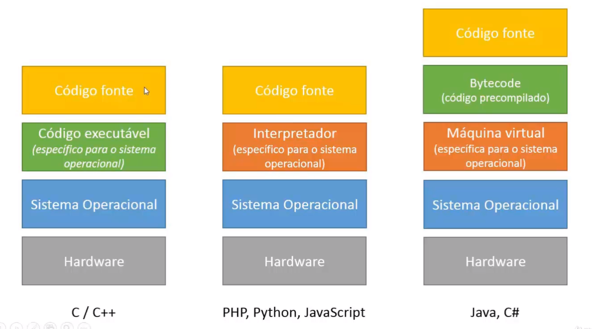

### 2: Introdução À Programação

## Compilação e Interpretação 

## Código Fonte e Objeto

## Maquina Virtual

---

**Código Fonte** - É a forma como escrevemos algoritmos. Para isso, utilizamos linguagens de programação que se comunicam com o computador;

**Compilação** - C, C++
É transformar o *código fonte* em um código que o computador possa processar. O compilador fará uma análise léxica e sintática do nosso código escrito em linguagem de programação e o transformará em **Código Objeto**. Nesta etapa é que vão aparecer os erros no código fonte, e o programador precisa resolvê-los para que o compilador tenha sucesso neste processo.
Nosso Código Objeto passa por um processo de construção (build) e vira um **código executável**.

Nem toda linguagem de programação precisa que o código fonte seja compilado, algumas linguagens passam apenas por um Interpretador.

**Interpretação** - Python, Ruby, PHP
Quando solicitado, o interpretador faz a análise Léxica e Sintática, e gera o código executável instantaneamente.  

**Linguagem Hibrida** - Java (JVM), C# (Microsoft .NET Framework)

O código fonte é pré compilado (passa por análise léxica e sintática) e vira um codigo objeto do tipo bytecode. Uma **máquina virtual** interpreta esse bytecode por demanda, gera o código executável e o executa.

---

### Vantagens

**Compilação**

* **Velocidade** - Nosso programa compilado é mais veloz.
* **Correções** - O nosso compilador nos ajuda de maneira que se tiver algum erro no código, ele nem será compilado, você terá que corrigir o problema antes de executar.

**Interpretação**

* **Flexibilidade** - Fácil manutenção do arquivo em execução. Basta trocar algum arquivo fonte e o programa segue executando normalmente, sem a necessidade de ser compilado.
* **Expressividade** - Códigos mais elegantes e complexos, mesmo utilizando poucas linhas. 
* **Multi plataformas** - O programa não precisa ser recompilado para rodar em plataformas diferentes, basta ter um interpretador.

**Hibridas** - As linguagens híbridas pegam algumas características 

* **Correções**
* **Multiplataformas**

